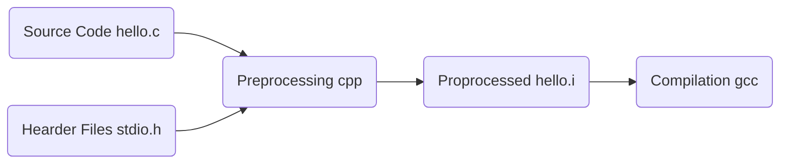
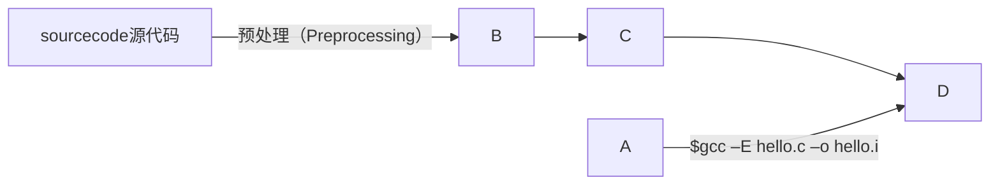

从源代码到可执行程序，需要经过以下步骤

-   预编译（Preprocessing）：`$gcc  –E  hello.c  –o  hello.i`或`$cpp hello.c > hello.i`
-   编译（Compilation）：
-   汇编（Assembly）：
-   链接（Linking）：

```flow
Source Code=>start: Source Code hello.c
input=>inputoutput: 输入
operation=>operation: 操作
condition=>condition: 操作出错？
output=>inputoutput: 输出
error=>operation: 请重新输入
end=>end: 结束

Source Code(right)->condition
condition(no,right)->output
condition(yes)->error(top)->input
output->end
```







