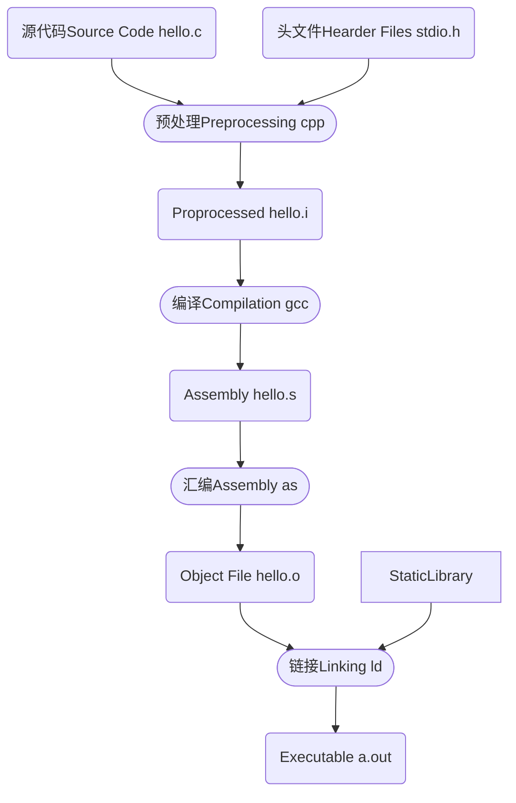

## 过程



从源代码到可执行程序，需要经过以下步骤

-   预处理（Preprocessing）：主要是处理源代码文件中的以"#"开始的预编译指令
-   编译（Compilation）：编译过程就是把预处理完的文件进行一系列词法分析、语法分析、语义分析及优化后生产相应的汇编代码文件，这个过程往往是我们所说的整个程序构建的核心部分，也是最复杂的部分之一。
-   汇编（Assembly）：汇编器是**将汇编代码转变成机器可以执行的指令**，每一个汇编语句几乎都对应一条机器指令。所以汇编器的汇编过程相对于编译器来讲比较简单，它没有复杂的语法，也没有语义，也不需要做指令优化，只是根据汇编指令和机器指令的对照表一一翻译就可以了，“汇编”这个名字也来源于此。
-   链接（Linking）：人们把每个源代码模块独立地编译，然后按照需要将它们“组装”起来，这个组装模块的过程就是链接

### 预编译

-   宏定义：将#define删除，展开所有宏定义
-   处理所有条件预编译指令：比如`#if`、`#ifdef`、`#elif`、`#else`、`#endif`
-   处理`#include`：**将被包含的文件插入到该位置**，该过程是递归进行的，也就是说被包含的文件可能还包含其他文件。（因此不要循环包含）
-   删除所有注释：包括`//`和`/* */`
-   添加行号的文件名标志，比如`#3 "hello.c"`，以便于编译时编译器产生调试用的行号信息以及用于编译时产生编译错误或警告时能够显示行号
-   保留所有的`#pragma`编译器指令，因为编译器必须要使用它们

## 编译命令

-   预编译：`$gcc  –E  hello.c  –o  hello.i`或`$cpp hello.c > hello.i`
-   编译：`$gcc  –S  hello.i  –o  hello.s`
-   汇编：`$as  hello.s  –o  hello.o`
-   链接：`$ld  -static  file1.o file2.o ...`


-   预处理和编译：现在版本的GCC把预编译和编译两个步骤合并成一个步骤，使用一个叫做cc1的程序来完成这两个步骤。这个程序位于“/usr/lib/gcc/i486-linux-gnu/4.1/”，我们也可以直接调用cc1来完成它：
    `$/usr/lib/gcc/i486-linux-gnu/4.1/cc1  hello.c`
-   预编译、编译和汇编：`$gcc  –c  hello.c  –o  hello.o`


### `-I`或`-include`


### `-I`或`-link`

## makefile

环境为windows10

-   安装gcc编译器，配置环境变量PATH=安装目录/bin，即含有gcc.exe的目录（否则你在使用make命令时得输入mingw32-make.exe的全路径）；复制一份该目录下的mingw32-make.exe的副本并重命名为make（否则你需要执行mingw32-make，而不是make）

-   创建makefile文件（不需要后缀名，否则你得在执行make的时候输入全名，比如`make makefile.txt`）
-   （在makefile所在目录下，否则你还得输入makefile的全路径）执行make命令

### 变量

-   可以定义一些变量，然后用$(变量)来使用
-   变量可以放在后边定义，不一定要放在最前边

```makefile
main.o: main.c
	$(CC) $(CFLAGS) $(CPPFLAGS) -c $<

CC = gcc
CFLAGS = -O -g
CPPFLAGS = -Iinclude
```

参考：[3. 变量 (akaedu.github.io)](http://akaedu.github.io/book/ch22s03.html)

### opengl glfw+glad库的makefile

``` makefile
CC = gcc
CXX = g++

COMPILE_FLAGS = -Wall -ggdb -O3
LINK_FLAGS = -lglfw3 -lopengl32 -lglu32 -lgdi32

projectpath = D:\UnityProject\LearnOpenGL\Opengl
glfw = $(projectpath)/glfw-3.3.6.bin.WIN64
glfw_inc = $(glfw)/include
glfw_lib = $(glfw)/lib-mingw-w64

glad = $(projectpath)/glad
glad_inc = $(glad)/include
glad_src = $(glad)/src/glad.c

INCLUDES = -I$(glfw_inc) -I$(glad_inc) -I$(projectpath)/MyWindow
LIBRARIES = -L$(glfw_lib)

cpp_files = main.cpp
objects = $(cpp_files:.cpp=.o)
headers = $(projectpath)/MyWindow/MyWindow.h

all: main.exe

main.exe: $(objects) glad.o
	$(CXX) $(LIBRARIES) -o main.exe $(objects) glad.o $(LINK_FLAGS)

$(objects): %.o: %.cpp $(headers) makefile
	$(CXX) $(COMPILE_FLAGS) $(INCLUDES) -c -o $@ $<
	
#glad.c is in glad/src, so we need full path
glad.o: $(glad_src)
	$(CC) $(COMPILE_FLAGS) $(INCLUDES) -c -o glad.o $(glad_src)
		
.PHONY : clean
clean:
	del *.o main.exe -rf
```

参考：[Makefile for C++ OpenGL with GLFW and glad - Code Review Stack Exchange](https://codereview.stackexchange.com/questions/78855/makefile-for-c-opengl-with-glfw-and-glad)


