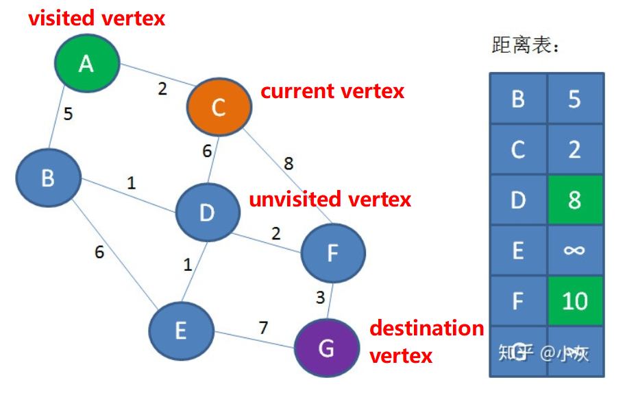

## 图的表示
简单图是**无自环**（顶点自己到自己有一条边）且**无重边**（从一个顶点到另一个顶点只有一条边）
如果从任意一个顶点都存在到任意另一个顶点的路径，那么这个图是连通图。非连通图由若干极大连通子图组成。

### 邻接矩阵
对于```v```个顶点，```e```条边的图，声明二维数组```array[v]```，下标表示顶点，```array[i, j]```表示顶点```i```到```j```的边```<i,j>```是否存在边（1表示存在，0表示不存在）。（对于有权图则是权重而不是0和1）
**优点**
- 查找快
- 代码简单

**缺点**
- 如果点很多，而边很少，则大部分元素都是0，浪费空间

**代码**
``` csharp
public class Vertex
{
    public int Value;

    public static implicit operator int(Vertex self)
    {
        return self.Value;
    }
}

public class Edge<TWeight>
{
    public Vertex From;
    public Vertex To;
    public TWeight Weight;
}

public class MatrixGraph<TWeight>
{
    private int _vertexCount;
    private int _edgeCount;

    private TWeight[,] _matrix;

    public MatrixGraph(int vertexCount)
    {
        _veretxCount = vertexCount;
        _matrix = new int[vertexCount, vertexCount];

        for (int row = 0; row < vertexCount; row++)
        {
            for (int column = 0; column < vertexCount; column++)
            {
                // init  matrix 
                //_graph[row, column] = 0;
            }
        }
    }

    public void InsertEdge(Edge edge)
    {
        _matrix[edge.From, edge.To] = edge.Weight;

        // if this is a undirected graph
        _matrix[edge.To, edge.From] = edge.Weight;
    }
}
```

### 邻接表
一维数组，每个元素指向一个链表
C#锯齿数组

**代码**
``` csharp
public class Vertex
{
    public int Value;

    public static implicit operator int(Vertex self)
    {
        return self.Value;
    }
}

public class Edge<TWeight>
{
    public Vertex From;
    public Vertex To;
    public TWeight Weight;
}

public class MatrixGraph
{
    private int _vertexCount;
    private int _edgeCount;

    private LinkedList<Vertex>[] _lists;

    public MatrixGraph(int vertexCount)
    {
        _lists = new LinkedList<Vertex>[vertexCount];
        for (int i = 0; i < _lists.Length; i++)
        {
            _lists[i] = new LinkedList<Vertex>();
        }
    }

    public void InsertEdge(Edge edge)
    {
        _lists[edge.From].Add(edge.To);
        // if this is a undirected graph
        _matrix[edge.To].Add(edge.From);
    }
}
```

### 最短路径
#### 无权图（单源）最短路径
距离表：key为顶点，value为到顶点到源顶点的最短距离
路径表：key为顶点，value为最短路径上的通向该顶点的上一个顶点
- BFS广度优先遍历，每遍历一层都更新一下距离表
``` csharp
void Unweighted(Vertex source)
{
    int[] distanceFromSource = new int[_vertexCount];
    distanceFromSource[source] = 0;
    Queue<Vertex> vertexQueue = new Queue<Vertex>();
    Enqueue(s);
    while (vertexQueue.Count > 0)
    {
        Vertex v = vertexQueue.Dequeue();
        for (int i = 0, i < _vertexCount; i++)
        {
            // != 0 means there is a edge from v to i 
            if (_matrix[v, i] != 0)
            {
                // -1说明该邻接顶点
                if (distanceFromSource[v] == -1)
                {
                    // update min distance from v to source
                    distanceFromSource[i] = distanceFromSource[v] + 1;
                    // enqueue adjacent vertex i to continue traversing
                    vertexQueue.Enqueue(i);
                }
            }
        }

    }
}
```

#### 有权图（单源）最短路径
dijkstra算法
**思路**
- 初始化距离表为正无穷，初始化路径表为null
- （从源顶点出发）访问当前顶点的邻接顶点，如果有更小的距离（待比较的最短距离 = 距离表中的源顶点到当前顶点的最短路径距离 + 从当前顶点到邻接顶点的边权重）并更新距离表
- 记录访问过的邻接顶点（以免再次访问）
- 从未访问过的顶点中取得距离源顶点最小的顶点，继续访问邻接顶点（从距离表查可得，正无穷表示该顶点还未被访问或是一个无法到达的孤立的顶点）
- 直到没有任何未访问过的顶点，迭代结束
- 从源顶点到任意其他顶点的最短路径距离可以直接查距离表得到，最短路径则需要使用路径表，以终点为key得到上一个顶点，直到顶点为源顶点（使用栈逆序输出即可）

**精髓**
- 递增性：假定图没有负权重的边
- DFS：相当于层次遍历。结合递增性，每层遍历结束，路径的权重都不会减少。虽然有的顶点还未访问，但此时得到了“当前状态下”的最短路径。

**其他**
一旦有新的顶点被访问，就可以继续更新距离表。如果有某个值被更新，则原本通过DFS找到的最短路径此时就不再是最短的，存在一条经过该未访问顶点的距离更短的通向目标顶点的“近路”。


``` csharp
public void Dijkstra(Vertex sourceVertex, Vertex destinationVertex, out int minDistance)
{
    int[] distances = new int[_vertexCount];
    for (int i = 0; i < distances.Length; i++)
    {
        distances[i] = int.maxValue;
    }
    Vertex[] paths = new Vertex[_vertexCount];
    HashSet<int> visitedVertexs = new HashSet<int>();
    Queue<Vertex> unvisitedVertexs = new Queue<Vertex>();
    unvisitedVertexs.Enqueue(sourceVertex);
    while (unvisitedVertexs.Count > 0)
    {
        Vertex currentVertex = unvisitedVertexs.Dequeue();
        // 从未访问顶点集合中取得距离源顶点最小的顶点
        // 可以用二叉堆优化，将插入顶点到未访问顶点集合中的复杂度变为O(logn)，访问距离最小顶点的复杂度变为O(logn)
        int minIndex = 0;
        for (int i = 1; i < distances.Length; i++)
        {
            if (visitedVertexs[i] != null) { continue; }
            if (distances[i] < distances[minIndex])
            { minIndex = i; }
        }
        // 遍历当前节点的所有邻接节点
        for (int i = 0; i < _vertexCount; i++)
        {
            // 当前节点已经访问过了（层次遍历且递增性，不应该往回遍历）
            if (visitedVertexs[currentVertex] != null) { continue; }
            // 通过邻接矩阵得到邻接节点
            Edge edgeToAdjacentVertex = _matrix[currentVertex, i];
            if (edgeToAdjacentVertex != -1)
            {
                // 从源顶点到当前节点再到邻接节点的总距离比距离表维护的从源顶点到邻接节点的最短距离还要短，那么更新它
                int distance = distances[currentVertex] + edgeToAdjacentVertex;
                if (distance < distances[i])
                {
                    distances[i] = distance;
                    path[i] = currentVertex;
                }
            }
        }
    }
    return distances[destinationVertex];
}


```

## 图的遍历
### DFS
一般用递归实现
### BFS
一般用队列迭代实现