## 协程执行顺序
假设有以下函数

    void Start()
    {
        StartCoroutine(Test());
    }

    IEnumerator Test()
    {
        Debug.Log("yield return null before");
        yield return null;
        Debug.Log("yield return null after");
    }

启动协程后，调用顺序大概是这样的

#### 第1帧
- 启动协程
- Test()函数被调用
- 输出"yield return null before"
- 遇到yield null，保存这个函数的上下文信息，return返回

#### 第2帧
- 由于上一帧有一个协程被yield了，因此当脚本生命周期运行到yield null时，这个协程被恢复，从上一次yield位置的下一条语句开始
- 输出"yield return null after"
- 离开Test()函数，上下文被销毁

这里的误区在于，看到"yield return null before"和"yield return null after"似乎是同时输出的，认为这两条输出语句是在同一帧执行的，其实是第二条语句在第二帧恢复协程后继续执行的。

## 协程的嵌套
假设有以下函数

    void Start()
    {
        StartCoroutine(Test1());
    }

    IEnumerator Test1()
    {
        Debug.Log("yield StartCoroutine before");
        yield return StartCoroutine(Test2());
        Debug.Log("yield StartCoroutine after");
    }

    IEnumerator Test2()
    {
        Debug.Log("yield return new WaitForSeconds before");
        yield return new WaitForSeconds(2f);
        Debug.Log("yield return new WaitForSeconds after");
    }

启动协程后，调用顺序大概是这样的

#### 第1帧
- Start启动协程Test1()
- Test1()函数被调用
- 输出"yield StartCoroutine before"
- 启动协程Test2()
- 输出"yield WaitForSeconds before"
- 遇到yield WaitForSeconds，保存这个函数的上下文信息，return返回

#### 第2帧
- yield WaitForSeconds，从上一次yield return new WaitForSeconds位置继续，但WaitForSeconds没有返回成功
- yield StartCoroutine，从上一次yield return StartCoroutine位置继续，但StartCoroutine没有返回成功

#### 中间帧同第2帧

#### 最后一帧
- yield WaitForSeconds，从上一次yield return new WaitForSeconds位置继续，WaitForSeconds返回成功，执行下一条语句
- 输出"yield return new WaitForSeconds after"
- 离开Test2函数，上下文被销毁
- yield StartCoroutine，从上一次yield return StartCoroutine位置继续，StartCoroutine返回成功，执行下一条语句
- 输出"yield StartCoroutine after"
- 离开Test1函数，上下文被销毁
