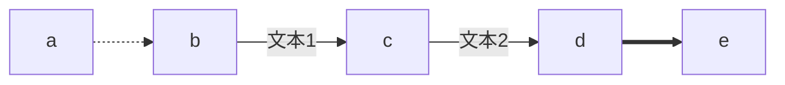

## 方向

graph TB表示图的走向是从上到下

## 形状

```mermaid
graph TB
    默认方形
    id1[方形]
    id2(圆边矩形)
    id3([体育场形])
    id4[[子程序形]]
    id5[(圆柱形)]
    id6((圆形))
```

```mermaid
graph
id1{菱形}
id2{{六角形}}
id3[/平行四边形/]
id4[\反向平行四边形\]
id5[/梯形\]
id6[\反向梯形/]
```

## 连线

``` mermaid
graph LR
a-.->b--文本1-->c-->|文本2|d==>e
```

