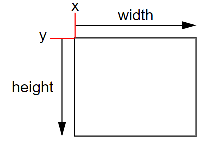
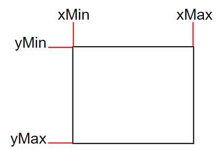

### 自定义Inspector   修饰CustomEditor(typeof(目标类))
``` csharp
//c# 示例 (LookAtPointEditor.cs)
using UnityEngine;
using UnityEditor;

[CustomEditor(typeof(LookAtPoint))]
[CanEditMultipleObjects]
public class LookAtPointEditor : Editor 
{
    SerializedProperty lookAtPoint;
    
    void OnEnable()
    {
        lookAtPoint = serializedObject.FindProperty("lookAtPoint");
    }

    public override void OnInspectorGUI()
    {
        serializedObject.Update();
        EditorGUILayout.PropertyField(lookAtPoint);
        serializedObject.ApplyModifiedProperties();
    }
}
```

### API
```csharp
// 空行，高度为一行的高度
GUILayout.Space(EditorGUIUtility.singleLineHeight)
EditorGUI.showMixedValue
GUILayout.Button
EditorGUILayout.Popup
EditorGUILayout.TextField
// 多选时，如果Property有不同的值，是否显示mixValue符号
EditorGUI.showMixedValue
```

### CustomShaderGUI

```csharp
public class CustomLitGUI : ShaderGUI
{
    public override void OnGUI(MaterialEditor materialEditor, MaterialProperty[] properties)
    {
        var property = FindProperty(propertyName, properties);
        // 如果选中了多个材质，材质上的对应属性可能有不同的值
        // editor.ShaderProperty会自动处理这些，但是如果用EditorGUI等绘制则需要手动处理
        EditorGUI.showMixedValue = property.hasMixedValue;
        // EditorGUILayout 或 EditorGUI 来绘制属性
        // 绘制完毕后记得重置
        EditorGUI.showMixedValue = false;
    }
```


### Rect

两种表示方法

-   x y表示（屏幕坐标下的）位置，width height表示宽高
    
-   xMin yMin xMax yMax表示（屏幕坐标下的）边界
    