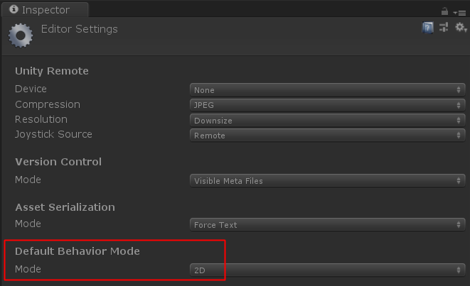

Menu -> Edit -> Project Settings -> Editor -> Default Behavior Mode

### 参考
- [Unity Manual: Working in Unity -> Getting Started -> Project Template](https://docs.unity3d.com/Manual/ProjectTemplates.html)
- [Unity Manual: Working in Unity -> Editor Features -> 2D and 3D mode settings](https://docs.unity3d.com/Manual/2DAnd3DModeSettings.html)
- [Unity Manual: Working in Unity -> Editor Features -> Project Settings](https://docs.unity3d.com/Manual/comp-ManagerGroup.html)
- [Unity Manual: Working in Unity -> Editor Features -> Project Settings -> Editor](https://docs.unity3d.com/Manual/class-EditorManager.html)
