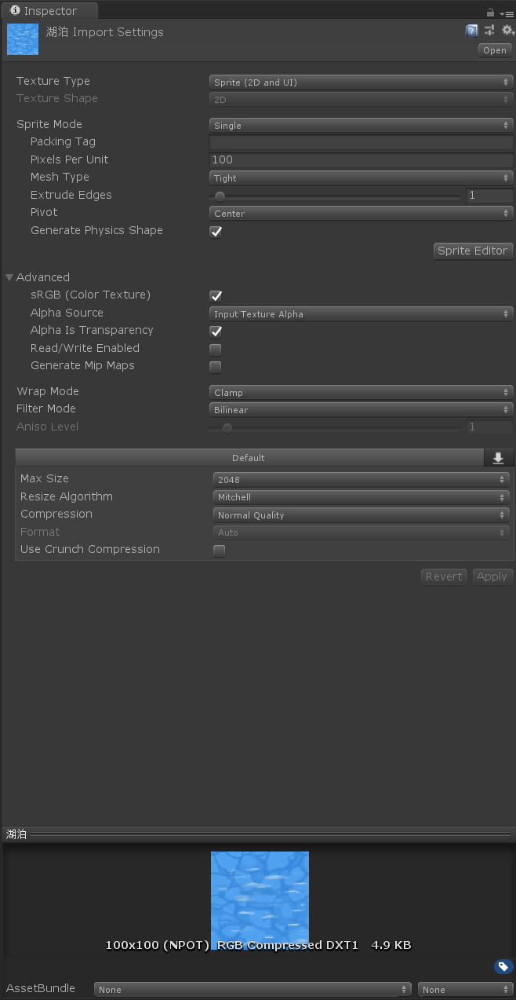
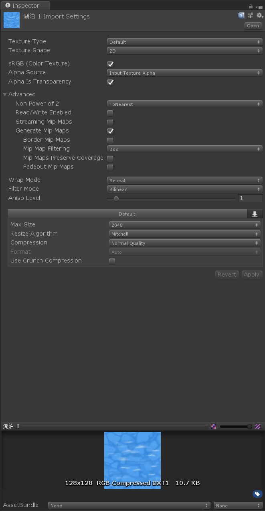

## 现象
使用Sprite.Create函数通过读取图片来创建Sprite
- Editor：显示正常
```csharp
  Texture2D texture = Resources.Load<Texture2D>("Textures" + Path.DirectorySeparatorChar + SpritePath);
  sprite = Sprite.Create(texture, Rect.MinMaxRect(0, 0, texture.width, texture.height), new Vector2(0.5f, 0.5f));
```
- 打包PC：图片比原尺寸（100 * 100像素）大一些
## 原因
- （Google找到的）创建项目时，template选择2D，当你导入任何png图片时，在图片导入设置里Texture Type会默认设置成Sprite(2D and UI)



- 其他非2D选项时，则会默认设置为Default，且Non Power of 2为ToNearest
Texture Type设置为Default，且Non Power of 2为ToNearest时，100 * 100像素的图片实际上是128 * 128像素


<br>

但是在资源浏览器里查看图片文件属性时是100 * 100像素的。


- 官方对Non Power of 2(NPOT)的解释如下：

| Non Power of 2 | If the Texture has a non-power of two (NPOT) dimension size, this defines a scaling behavior at import time. See documentation on Importing Textures for more information on non-power of two sizes. This is set to None by default. |
| ------ | ------ |
| None | Texture dimension size stays the same. |
| To nearest | The Texture is scaled to the nearest power-of-two dimension size at import time. For example, a 257x511 px Texture is scaled to 256x512 px. Note that PVRTC formats require Textures to be square (that is width equal to height), so the final dimension size is upscaled to 512x512 px. |
| To larger | The Texture is scaled to the power-of-two dimension size of the largest dimension size value at import time. For example, a 257x511 px Texture is scaled to 512x512 px. |
| To smaller | The Texture is scaled to the power-of-two dimension size of the smallest dimension size value at import time. For example, a 257x511 px Texture is scaled to 256x256 px. |

设置为ToNearest时，100 * 100像素的图片实际上会被缩放到最接近2的幂的尺寸，也就是128 * 128

## 解决方法
- 将Texture Type改为Sprite(2D and UI)，建议所有用于Sprite用途的图片都选择此项，体积更小
- Texture Type保持为Default，将Non Power of 2设置为None（不建议，因为体积更大，即使在相同Compression Quality下）


### 参考：
- [Unity官方 TextureTypes](https://docs.unity3d.com/560/Documentation/Manual/TextureTypes.html)
- [Unity官方 Texture compression](https://docs.unity3d.com/Manual/class-TextureImporterOverride.html)
