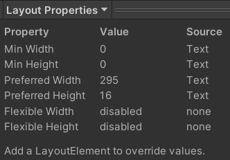
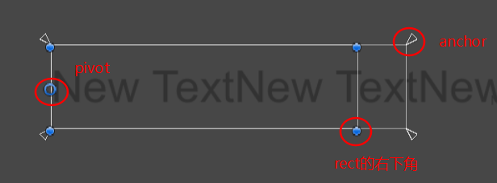

### 布局控制器

实现了 **ILayoutController** 的类型
常见的有 Horizontal/Vertical/Grid Layout Group、ContentSizeFitter
至少有一个布局控制器，布局才会生效
（本身也实现了ILayoutElement，所以才会有布局的相关属性）

### 布局属性

Image、Text等组件都实现了 **ILayoutElement** 接口，因此有这些布局属性
选中任意RectTransform物体，在Inspector面版下将预览窗口切换成Layout Properties，可以直接查看有关属性

- Min：布局生效时，子元素最小尺寸像素
- **Preferred：布局生效时，首选子元素尺寸像素**
- Flexible：表示占父UI尺寸的权重，即使未开启，也有默认值为1。布局生效时，布局控制器（即父物体）会收集所有子UI的Flexible权重，对应子UI的尺寸为 父UI尺寸 * 子UI权重 / 父UI权重



如果Padding不为0，那么Width要加上Left+Right，Height要加上Top+Bottom

#### 自动设置布局属性

**Image会自动设置Preferred为sprite的宽高像素**（如果在Sprite Editor里编辑了Border，那么会被实际设置成宽高减去border）
**Text会自动设置Preferred为实际文本宽度**（相当于Horizontal Overflow设置为Overflow时表现的宽度）。像素大小无法预计，与字体大小、字体、实际文本有关。

Flexible默认是不开启的

#### Vertical Layout Group

- Control Child Size：

    | Control Child Size | 宽度                                      | 高度                                  |
    | ------------------ | ----------------------------------------- | ------------------------------------- |
    | 未勾选             | 子LayoutElement的 width 的最大值          | 子LayoutElement的 height 总和         |
    | 勾选               | 子LayoutElement的 Min或Preferred 的最大值 | 子LayoutElement的 Min或Preferred 总和 |

- Child Force Expand：勾选则开启Flexible，并设置为1，不勾选则关闭

- Use Child Scale：

### 自定义Layout - Layout Element

- Ignore Layout：不受布局影响（对它来说就像是父UI没有布局组件一样，相当于将特定UI排除在布局之外，因为有时候不希望所有子物体都受布局影响，但又不得不做成子UI时就可以这么做）
- 其他属性：覆盖原本对应的Min/Preferred/Flexible
- Layout Priority：如果同一层级上有多个子UI都使用了Layout Element组件，那么这个优先级决定了哪个子UI的Layout Element最先被计算

### Content Size Filter

**光是有布局属性并没有什么用，这个组件会使用某些布局属性来设置RectTransform的宽高**

比如 Text 的 Horizontal/Vertical Overflow 虽然会影响 Text 的表现，但不影响布局属性，所以不会影响 RectTransform 的宽高

### RectTransform



-   **rect**：在编辑器上能直观看到的UI的边界，rect.min 和 rect.max 分别表示左下角和右上角的位置
-   anchor（锚点）： **使得锚点的四个角与rect的四个角的距离保持不变**。anchorMin 表示锚点左下角在父节点位置的百分比，anchorMax 表示右上角，范围[0, 1]
-   pivot：矩形绕这个点进行旋转
-   localPosition：pivot到父RectTransform的pivot的相对位置
-   anchoredPosition：**计算很复杂，还未完全弄明白，不要使用这个** anchoredPosition = offsetMin + Vector2.Scale(sizeDelta, rect.pivot)
-   offsetMax：矩形右上角相对于锚框右上角的偏移
-   offsetMin：矩形左下角相对于锚框左下角的偏移
-   sizeDelta：The size of this RectTransform relative to the distances between the anchors. 另一种表示RectTransform的大小的方式。sizeDelta = offsetMax - offsetMin，几何意义是**rect本身大小**减去**锚框**大小，**如果是为了获得rect区域大小，不要使用这个，而是使用rect**

``` csharp
[SerializeField] private RectTransform rectTransform;
[SerializeField] private RectOffset padding = new RectOffset();
// 手动应用自定义的 RectOffset，用 RectOffset 表示到边界的距离。仅在anchor设置在四个角落时的情况下有效，即 anchorMin = Vector2.zero 且 anchorMax = Vector2.one
rectTransform.anchorMin = Vector2.zero;
rectTransform.anchorMax = Vector2.one;
rectTransform.offsetMin = new Vector2(padding.left, padding.bottom);
rectTransform.offsetMax = new Vector2(-padding.right, -padding.top);
```

### Rect

两种表示方法

-   x y表示（屏幕坐标下的）位置，width height表示宽高
    
-   xMin yMin xMax yMax表示（屏幕坐标下的）边界
    

-   min、max：左上角、右下角以pivot为原点的localPosition
-   position：等同于min
-   size： x、y分别表示 width 和 height，width = max.x - min.x，height = max.y - min.y，size = max - min
    rect.size 直接表示了实际的rect大小，而 preferred 则是根据实现了 ILayoutElement 的类型如 Text、Image等自动设置（或者用LayoutElement自定义）

### API

``` csharp
// 取得RectTransform的preferred width（RectTransform没有 preferredWidth 字段）
float preferredWidth = LayoutUtility.GetPreferredWidth(rectTransform);
```


参考：

-   [UI FitContentSize from Unity Offical Manual](https://docs.unity3d.com/Packages/com.unity.ugui@1.0/manual/HOWTO-UIFitContentSize.html)
-   https://zhuanlan.zhihu.com/p/119442308